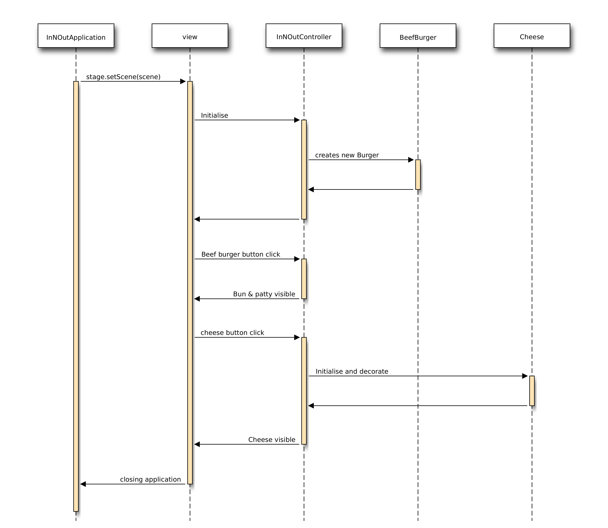
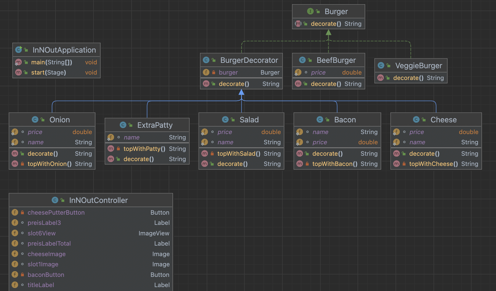

# InNOutFX

## Use Case

Spieler startet die Applikation -> JavaFX öffnet ein Fenster. In diesem Fenster sind mehrere Buttons ersichtlich. Beim Klicken auf einer der 3 Buttons kann man die Art Burger auswählen. Es erscheint Das Brot und "Fleisch" vom Burger. Man kann mit den weiteren Buttons den Burger mit 6 zusätlichen Zutaten belegen. 

Am Schluss ist ein ganzer Burger ersichtlich und daneben wird der Totale Preis und der Preis der einzelnen Zutaten angezeigt. 

Mit dem Reset-Button kann man den Prozess beliebig oft wiederholen.

## Sequenzdiagram

## Klassendiagram

Das Klassendiagram beinhaltet alle klassen, aber es ist zu beachten dass der Controller so viele felder beinhaltet dass es nicht wirklich möglich ist es auf einem Bild darzustellen.

## Arbeitsschritte

- Ich habe zuerst ein Grundprojekt mit einenm Decorator-Pattern erstellt
- Danach habe ich ein JavaFX-Projekt erstellt
- Die View mit den einzelnen Komponenten wurde im FXML format erstellt
- Die dazugehörigen Objekte und Funktionen wurden im Controller definiert
- Um der UI schöner zu machen wurde ein separates Stylesheet in css erstellt
  
## Testfälle

| ID | Expected                                                                                                        | Result                                                                                                          |
|----|-----------------------------------------------------------------------------------------------------------------|-----------------------------------------------------------------------------------------------------------------|
| 1  | burgerButton is clickable and sets burgerText to "Beef Burger" and burger to BeefBurger instance.              | burgerButton is clickable and sets burgerText to "Beef Burger" and burger to BeefBurger instance.              |
| 2  | veggieBurgerButton is clickable and sets burgerText to "Veggie Burger" and burger to VeggieBurger instance.    | veggieBurgerButton is clickable and sets burgerText to "Veggie Burger" and burger to VeggieBurger instance.    |
| 3  | chickenBurgerButton is clickable and sets burgerText to "Chicken Burger" and burger to ChickenBurger instance. | chickenBurgerButton is clickable and sets burgerText to "Chicken Burger" and burger to ChickenBurger instance. |
| 4  | resetButton is clickable and resets burgerText to "Burger", sets burger to BeefBurger instance, sets count to 0, and all preisLabel labels to "0". | resetButton is clickable and resets burgerText to "Burger", sets burger to BeefBurger instance, sets count to 0, and all preisLabel labels to "0". |
| 5  | cheesePutterButton is clickable and sets preisLabel1 to 1.50 and adds 1.50 to the total price displayed in preisLabelTotal. | cheesePutterButton is clickable and sets preisLabel1 to 1.50 and adds 1.50 to the total price displayed in preisLabelTotal. |
| 6  | baconButton is clickable and sets preisLabel2 to 2.00 and adds 2.00 to the total price displayed in preisLabelTotal. | baconButton is clickable and sets preisLabel2 to 2.00 and adds 2.00 to the total price displayed in preisLabelTotal. |
| 7  | saladButton is clickable and sets preisLabel3 to 1.00 and adds 1.00 to the total price displayed in preisLabelTotal. | saladButton is clickable and sets preisLabel3 to 1.00 and adds 1.00 to the total price displayed in preisLabelTotal. |
| 8  | onionButton is clickable and sets preisLabel4 to 0.50 and adds 0.50 to the total price displayed in preisLabelTotal. | onionButton is clickable and sets preisLabel4 to 0.50 and adds 0.50 to the total price displayed in preisLabelTotal. |
| 9  | extraPattyButton is clickable and sets preisLabelPatty to 1.50 and adds 1.50 to the total price displayed in preisLabelTotal. | extraPattyButton is clickable and sets preisLabelPatty to 1.50 and adds 1.50 to the total price displayed in preisLabelTotal. |
| 10 | slot1View, slot2View, slot3View, slot4View, slot5View, slot6View, and topView display the images set in their respective Image fields. | slot1View, slot2View, slot3View, slot4View, slot5View, slot6View, and topView display the images set in their respective Image fields. |
